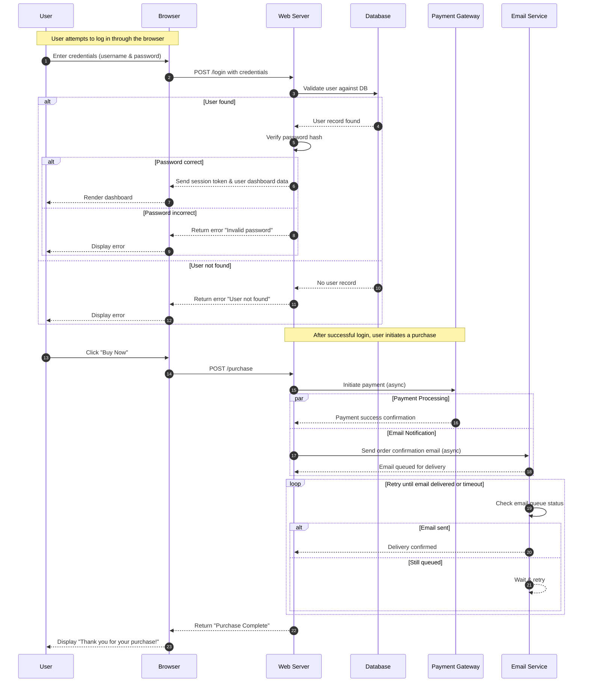
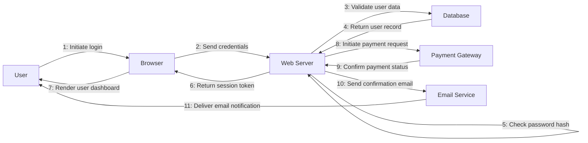
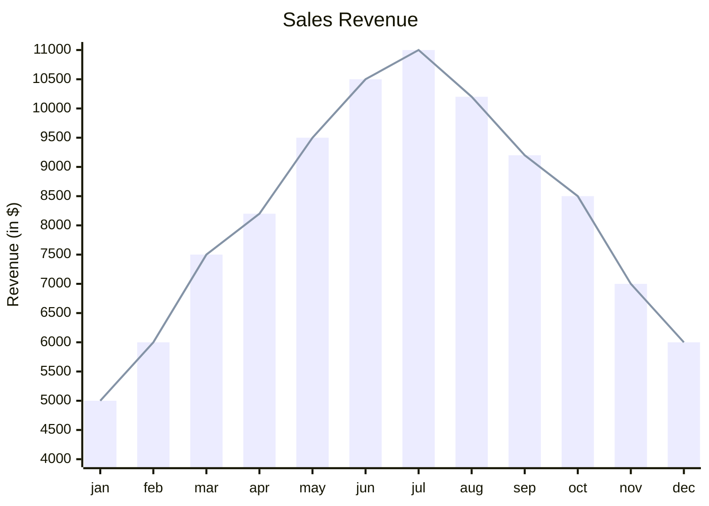

# Main Title

## Section 1: Text Formatting
Plain text
**Bold text**
*Italic text*
***Bold and italic text***
~~Strikethrough text~~
==Highlighted text== 
^Superscript^ text
~Subscript~ text

## Section 2: Lists
### Unordered List
* Item 1
* Item 2
  * Sub-item 2.1
  * Sub-item 2.2

### Ordered List
1. First item
2. Second item
   1. Sub-item 2.1
   2. Sub-item 2.2

## Section 3: Links and References
[Link text](https://example.com)

[Reference link][ref1]

[ref1]: https://example.com

## Section 4: Images


![Referenced image][img1]

[img1]: https://picsum.photos/536/352

## Section 5: Blockquotes
> Single line quote
>> Nested blockquote
> Multiple line quote
> continues here

## Section 6: Code
Inline `code` example

```python
def hello_world():
    print("Hello, World!")
```

## Section 7: Tables
| Header 1 | Header 2 | Header 3 |
|----------|----------|----------|
| Cell 1   | Cell 2   | Cell 3   |
| Cell 4   | Cell 5   | Cell 6   |

## Section 8: Horizontal Rules
---
***
___

## Section 9: Task Lists
- [x] Completed task
- [ ] Incomplete task
- [x] Another completed task

## Section 10: Footnotes
Here's a sentence with a footnote[^1].
[^1]: This is the footnote content.

## Section 11: Definition Lists
Term 1
: Definition 1

Term 2
: Definition 2

## Section 12: Mathematics
Inline math: $E = mc^2$

Block math:

$$
\sum_{i=1}^{n} x_i = \frac{n(n+1)}{2}
$$

$$
f(x) = \int_{a}^{b} \left( e^{-x^2} \cdot \cos(\pi x) \right) dx + \sum_{n=1}^{\infty} \frac{1}{n^2 + 1}
$$


## Section 13: Comments
[//]: # (This is a comment that won't be rendered)

## Section 14: Escaping Characters
\* Not italic \*
\` Not code \`
\[ Not a link \]

## Section 15: Abbreviations
*[HTML]: Hyper Text Markup Language
HTML is a markup language.

## Section 16: Custom HTML
<details>
<summary>Click to expand</summary>
This is hidden content.
</details>

<div align="center">
Centered text
</div>

## Section 17: Emojis
:smile: :heart: :thumbsup:

## Section 18: Mermaid Graph Diagrams


## Section 19: Mermaid Sequence Diagrams



## Section 20: Mermaid Graph Diagrams 2



## Section 21: Mermaid XY Chart 




## Section 21: STL

```stl
solid cube_corner
  facet normal 0.0 -1.0 0.0
    outer loop
      vertex 0.0 0.0 0.0
      vertex 1.0 0.0 0.0
      vertex 0.0 0.0 1.0
    endloop
  endfacet
  facet normal 0.0 0.0 -1.0
    outer loop
      vertex 0.0 0.0 0.0
      vertex 0.0 1.0 0.0
      vertex 1.0 0.0 0.0
    endloop
  endfacet
  facet normal -1.0 0.0 0.0
    outer loop
      vertex 0.0 0.0 0.0
      vertex 0.0 0.0 1.0
      vertex 0.0 1.0 0.0
    endloop
  endfacet
  facet normal 0.577 0.577 0.577
    outer loop
      vertex 1.0 0.0 0.0
      vertex 0.0 1.0 0.0
      vertex 0.0 0.0 1.0
    endloop
  endfacet
endsolid
```

