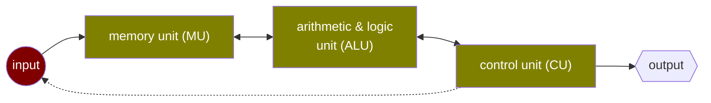

```mermaid
flowchart LR
    Input((input))
    MU["memory unit (MU)"]
    ALU["arithmetic & logic<br/>unit (ALU)"]
    CU["control unit (CU)"]
    Output{{output}}
    
    Input --> MU
    MU <--> ALU
    ALU <--> CU
    CU --> Output
    CU -.-> Input
    
    style Input fill:#800000,color:#fff
    style MU fill:#808000,color:#fff
    style ALU fill:#808000,color:#fff
    style CU fill:#808000,color:#fff
```
